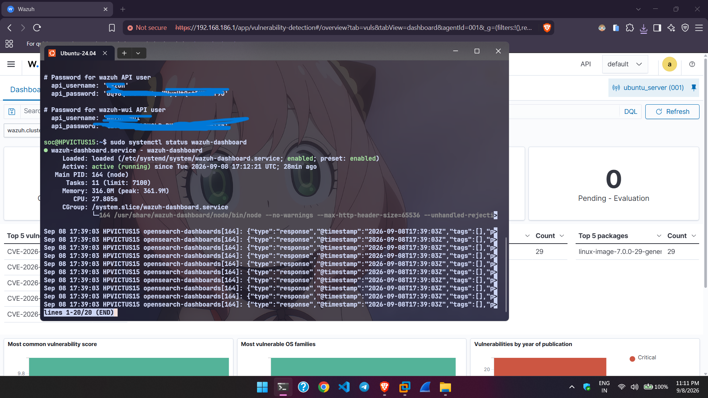
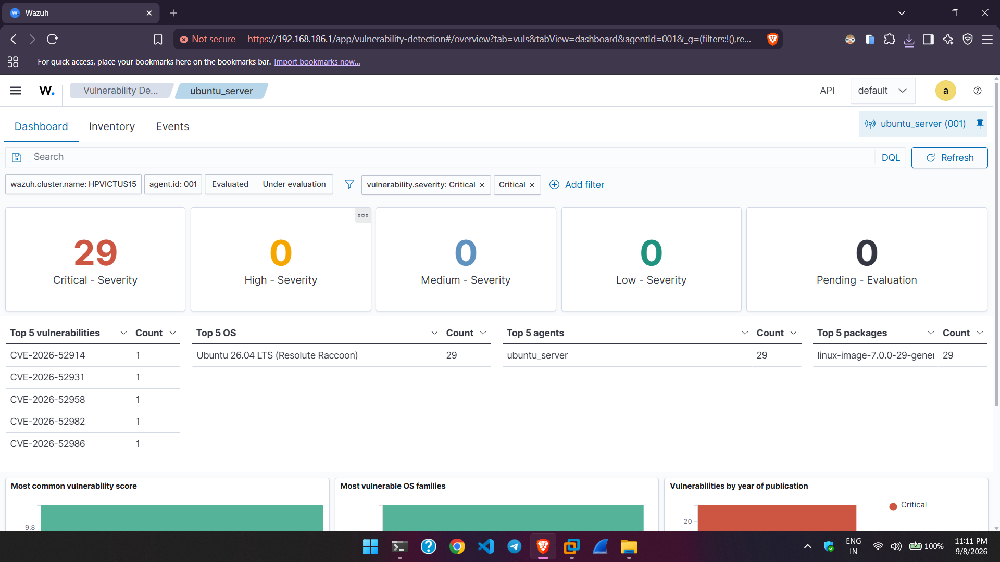
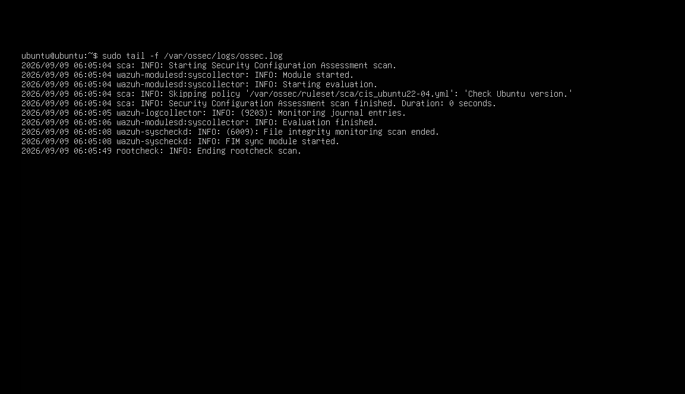

# Setting Up a Wazuh Server on WSL Ubuntu with VMware Agent Enrollment

This guide walks through deploying a Wazuh server on WSL (Windows Subsystem for Linux) Ubuntu and enrolling VMware Workstation VMs (Ubuntu Server and Windows 10) as monitored agents — using a **stable, router-independent network path** that survives reboots, Wi-Fi changes, and WSL's own IP churn.

> **Note on approach:** An earlier version of this guide used Hyper-V bridged/mirrored networking to expose WSL directly on the LAN. That approach is unreliable on Wi-Fi-only machines and shared networks you don't control (bridging to Wi-Fi is flaky by design, and DHCP reservations require router access you may not have). This version instead uses VMware's own private host-only network plus automatic port forwarding — no router involvement, no Hyper-V switch required.

## Table of Contents

- [Overview](#overview)
- [Prerequisites](#prerequisites)
- [Part 1: Install Wazuh on WSL Ubuntu](#part-1-install-wazuh-on-wsl-ubuntu)
- [Part 2: Put VMware Agent VMs on the Host-Only Network](#part-2-put-vmware-agent-vms-on-the-host-only-network)
- [Part 3: Set Up Automatic Port Forwarding](#part-3-set-up-automatic-port-forwarding)
- [Part 4: Access the Wazuh Dashboard](#part-4-access-the-wazuh-dashboard)
- [Part 5: Enroll a New Agent](#part-5-enroll-a-new-agent)
- [Troubleshooting](#troubleshooting)
- [Why This Setup Is Permanent](#why-this-setup-is-permanent)
- [References](#references)

## Overview

WSL's internal IP changes on every restart, and bridging it directly onto a Wi-Fi network you don't control is unreliable. Instead, this setup uses:

- **VMware's host-only network (`VMnet1`)** — a private virtual LAN with a fixed host IP (`192.168.186.1` in this guide) that never changes, regardless of what Wi-Fi network you're on.
- **A Windows-side port-forwarding script**, run automatically at every login via Task Scheduler, that keeps traffic flowing from the fixed IP to WSL's current (changing) internal IP.

Agent VMs only ever need to know one address — the fixed VMware host IP — permanently.

## Prerequisites

- A Windows 10/11 host machine with administrator access
- WSL 2 with an Ubuntu distribution installed
- At least 6 GB of RAM available to allocate to WSL
- VMware Workstation with an Ubuntu Server VM and/or Windows 10 VM to act as agents
- No router/network admin access required

## Part 1: Install Wazuh on WSL Ubuntu

WSL can stay on its default NAT networking — no custom `.wslconfig` networking mode is needed.

1. If you previously configured Hyper-V bridging or mirrored mode, revert it:

   Edit `%userprofile%\.wslconfig` and remove any `networkingMode` line:

   ```ini
   [wsl2]
   memory=6GB
   processors=4
   swap=4GB
   ```

   Restart WSL:

   ```powershell
   wsl --shutdown
   ```

2. Install Wazuh using the official automated installation script:

   ```bash
   curl -sO https://packages.wazuh.com/4.14/wazuh-install.sh && sudo bash ./wazuh-install.sh -a
   ```

3. Once finished, the installer prints a summary with dashboard credentials:

   ```
   INFO: --- Summary ---
   INFO: You can access the web interface https://<WAZUH_DASHBOARD_IP_ADDRESS>
       User: admin
       Password: <ADMIN_PASSWORD>
   INFO: Installation finished.
   ```

   All generated passwords are stored in `wazuh-passwords.txt` inside `wazuh-install-files.tar`. To view them later:

   ```bash
   sudo tar -O -xvf wazuh-install-files.tar wazuh-install-files/wazuh-passwords.txt
   ```

   

## Part 2: Put VMware Agent VMs on the Host-Only Network

1. In VMware Workstation, open each agent VM's **Settings → Network Adapter**.
2. Set it to **Host-only: VMnet1** (not NAT/VMnet8, not Bridged).
3. Boot the VM and confirm it received an address on that subnet:

   ```bash
   ip addr show   # Ubuntu Server VM
   ```
   ```powershell
   ipconfig       # Windows 10 VM
   ```

4. On the Windows host, confirm the host-only adapter's fixed IP:

   ```powershell
   ipconfig | findstr /C:"VMnet1" /A:5
   ```

   This will typically show `192.168.186.1` — adjust the rest of this guide if yours differs.

## Part 3: Set Up Automatic Port Forwarding

Instead of pinning WSL's own IP (which is unreliable), we forward the required Wazuh ports from the fixed VMware host-only IP to WSL's current IP, and refresh that mapping automatically on every login.

1. Create the forwarding script (run PowerShell **as Administrator**):

   ```powershell
   New-Item -ItemType Directory -Force -Path "C:\Scripts" | Out-Null
   @'
   $wslIp = (wsl hostname -I).Trim().Split(" ")[0]
   $ports = @(1514, 1515, 55000, 443)
   foreach ($port in $ports) {
       netsh interface portproxy delete v4tov4 listenaddress=192.168.186.1 listenport=$port 2>$null | Out-Null
       netsh interface portproxy add v4tov4 listenaddress=192.168.186.1 listenport=$port connectaddress=$wslIp connectport=$port
   }
   Write-Host "Forwarded ports $($ports -join ', ') from 192.168.186.1 -> $wslIp"
   '@ | Out-File -Encoding utf8 "C:\Scripts\wsl-wazuh-portproxy.ps1"
   ```

2. Run it once to apply the mapping immediately:

   ```powershell
   powershell -ExecutionPolicy Bypass -File C:\Scripts\wsl-wazuh-portproxy.ps1
   ```

3. Allow the ports through the Windows firewall (one-time):

   ```powershell
   New-NetFirewallRule -DisplayName "Wazuh WSL Forward" -Direction Inbound -Action Allow -Protocol TCP -LocalPort 1514,1515,55000,443
   ```

4. Register a scheduled task so this re-runs automatically at every login:

   - Open **Task Scheduler → Create Task**
   - **General**: Name it `WSL Wazuh Port Proxy`, check **Run with highest privileges**
   - **Triggers**: New → **At log on**, set a 1-minute delay
   - **Actions**: New → Program: `powershell.exe`, Arguments:
     ```
     -ExecutionPolicy Bypass -File "C:\Scripts\wsl-wazuh-portproxy.ps1"
     ```
   - Save

5. Verify the task is registered and ready:

   ```powershell
   Get-ScheduledTask -TaskName "WSL Wazuh Port Proxy" | Select-Object TaskName, State
   ```

   Expected output:

   ```
   TaskName             State
   --------             -----
   WSL Wazuh Port Proxy Ready
   ```

6. Confirm the forwarding rules are active:

   ```powershell
   netsh interface portproxy show v4tov4
   ```

   You should see the fixed IP mapped to WSL's current IP on all four ports, e.g.:

   ```
   Address         Port        Address         Port
   --------------- ----------  --------------- ----------
   192.168.186.1   1514        192.168.50.230  1514
   192.168.186.1   1515        192.168.50.230  1515
   192.168.186.1   55000       192.168.50.230  55000
   192.168.186.1   443         192.168.50.230  443
   ```

   If you see stale entries pointing at an old IP from a previous attempt, remove them:

   ```powershell
   netsh interface portproxy delete v4tov4 listenaddress=<old_ip> listenport=<port>
   ```

## Part 4: Access the Wazuh Dashboard

From the Windows host (or any device on the VMware host-only network):

```
https://192.168.186.1
```

Log in with:

- **Username:** `admin`
- **Password:** from `wazuh-passwords.txt` (see Part 1, step 3)



## Part 5: Enroll a New Agent

Point agents at the fixed VMware host-only IP — never at WSL's own changing IP.

**Ubuntu agent VM:**

```bash
wget https://packages.wazuh.com/4.x/apt/pool/main/w/wazuh-agent/wazuh-agent_4.14.7-1_amd64.deb && \
sudo WAZUH_MANAGER='192.168.186.1' dpkg -i ./wazuh-agent_4.14.7-1_amd64.deb

sudo systemctl daemon-reload
sudo systemctl enable wazuh-agent
sudo systemctl start wazuh-agent
```


**Windows 10 agent VM:** In the Wazuh dashboard's **Deploy new agent** wizard, enter `192.168.186.1` as the server address and follow the generated install command.

**If an agent was previously enrolled against a different/stale IP**, update its config directly instead of re-enrolling (the key stays valid if the server line uses `any`):

```bash
sudo sed -i 's/<old_ip>/192.168.186.1/g' /var/ossec/etc/ossec.conf
sudo systemctl restart wazuh-agent
```

## Troubleshooting

**Check agent connectivity from the agent VM:**

```bash
nc -zv 192.168.186.1 1514
nc -zv 192.168.186.1 1515
```

Both should report `succeeded`.

**Check the agent's own connection log:**

```bash
sudo tail -f /var/ossec/logs/ossec.log
```

Look for:

```
INFO: Trying to connect to server ([192.168.186.1]:1514/tcp).
INFO: Connected to the server ([192.168.186.1]:1514/tcp).
```

If it instead shows an old IP, the agent's `ossec.conf` wasn't updated — re-run the `sed` command above.

**Check the enrollment key is valid (server side, inside WSL):**

```bash
sudo cat /var/ossec/etc/client.keys
```

**Check the dashboard:** Agents Summary should show the agent as **Active**, not **Disconnected**, within about a minute of a successful connection.

**After a Windows reboot**, verify the automation actually re-synced without manual intervention:

```powershell
wsl hostname -I
netsh interface portproxy show v4tov4
```

The IP on the right side of the portproxy table should match `wsl hostname -I`'s current output.

## Why This Setup Is Permanent

| Component | Status |
|---|---|
| VMware host-only IP (`192.168.186.1`) | Static — set by VMware, unaffected by Wi-Fi/router |
| Agent `ossec.conf` server address | Fixed, one-time |
| Enrollment key (`any` scope) | Reusable, survives IP changes |
| Windows firewall rule | Persists across reboots |
| Port-proxy → WSL IP sync | Re-applied automatically at every login via Task Scheduler |

The only thing that still changes is WSL's internal IP — and the scheduled task exists specifically to absorb that change, so nothing downstream (agents, dashboard address, enrollment) ever needs to be touched again.

**Caveat:** If Wazuh is reinstalled/upgraded or agent keys are regenerated, the enrollment step in Part 5 will need to be redone — but the networking layer in Part 2–3 will not.

## References

- [Wazuh Official Documentation](https://documentation.wazuh.com/)
- [VMware Workstation Network Adapter Types](https://docs.vmware.com/)
